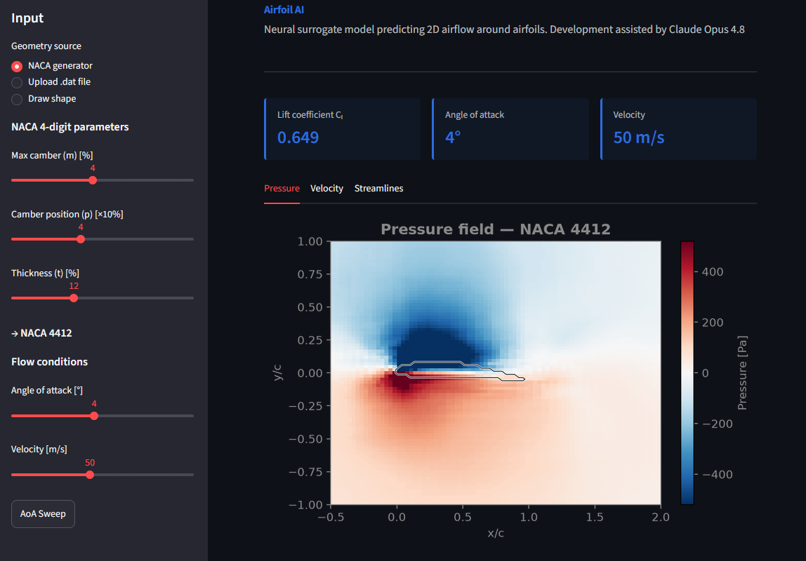
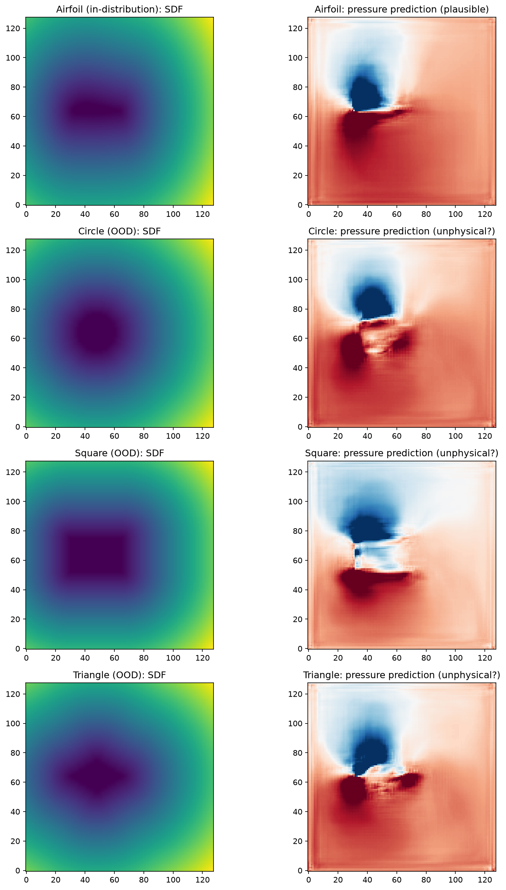

# Airfoil AI

**Airfoil-AI is a neural surrogate model that predicts 2D airflow around airfoils from geometry alone**

**[Live demo](https://airfoil-ai-fwz2lwpzhjm5phssckeq6b.streamlit.app)**

---

## Overview

Airfoil AI is a U-Net based surrogate model trained on the [AirfRANS](https://arxiv.org/abs/2212.07564) dataset of RANS CFD simulations. Given an airfoil shape, angle of attack, and inlet velocity, it predicts the surrounding pressure and velocity fields in milliseconds.

This project was built as a portfolio piece exploring machine-learning surrogate models for aerodynamics. It is a reimplementation of established ideas ([References](#references)) with original additions.

## Demo

The interactive Streamlit app lets you:
- Generate **NACA 4-digit airfoils** with sliders
- Upload your own airfoil coordinates (**.dat / .txt** format)
- **Draw** an arbitrary shape and watch the model try to analyze its aerodynamics and most likely fail
- Sweep angle of attack to plot the **lift curve**

## How it works

1. **Data**: AirfRANS dataset contains 1000 simulations, the model is trained on 800 simulations and the rest is used to evaluate and improve the model.
2. **Preprocessing**: each simulation is interpolated from its unstructured mesh onto a regular 128×128 grid. Geometry is encoded as a signed distance function (SDF).
3. **Model**: a U-Net (ResNet-34 encoder) maps a 3-channel input (SDF, angle, velocity) to a 3-channel output (pressure, u, v).
4. **App**: any input geometry is converted to the same SDF format and fed to the model for real-time inference.

## Architecture

**Input** (3 × 128 × 128): signed distance function · angle of attack · inlet velocity
**Output** (3 × 128 × 128): pressure · x-velocity · y-velocity

## Limitations

This is a demonstration model, not an engineering tool. Known limitations of the model:

- **Drag (Cd) is not predicted.** Accurate drag requires  near-wall shear stress, which the 128×128 grid does not provide. The model focuses on pressure-driven lift.
- **Surface accuracy.** The U-Net tends to smooth sharp gradients near the airfoil surface (e.g. the suction peak), so surface-level predictions are less accurate than the overall field.
- **Out-of-distribution shapes fail predictably.** If the user inputs a shape that does not resemble an airfoil, the model will hallucinate and is not capable of accounting for real physical phenomena like flow separation or turbulent air flow in general.

## Tech stack

- **ML**: PyTorch, segmentation-models-pytorch (U-Net)
- **Data**: AirfRANS, SciPy, NumPy
- **App**: Streamlit, Matplotlib
- **Dataset**: [AirfRANS](https://arxiv.org/abs/2212.07564)

## References

- Bonnet et al. (2022), *AirfRANS: High Fidelity Computational Fluid Dynamics Dataset for Approximating Reynolds-Averaged Navier–Stokes Solutions* — [arXiv:2212.07564](https://arxiv.org/abs/2212.07564)
  
- Thuerey, N., Weißenow, K., Prantl, L., & Hu, X. (2020). *Deep Learning Methods for Reynolds-Averaged Navier–Stokes Simulations of Airfoil Flows.* AIAA Journal, 58(1), 25–36. [arXiv:1810.08217](https://arxiv.org/abs/1810.08217)

## Acknowledgements

Development assisted by Claude (Anthropic).

## Future development

Add comparison between XFOIL and model's predictions

## License

This project is licensed under the MIT License — see the [LICENSE](LICENSE) file for details.